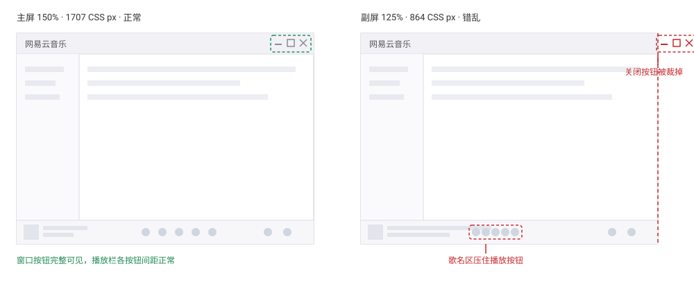
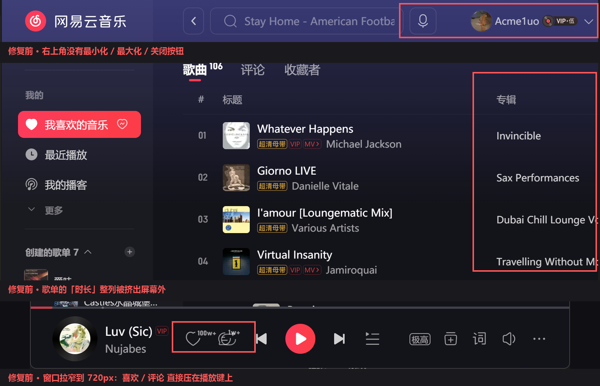
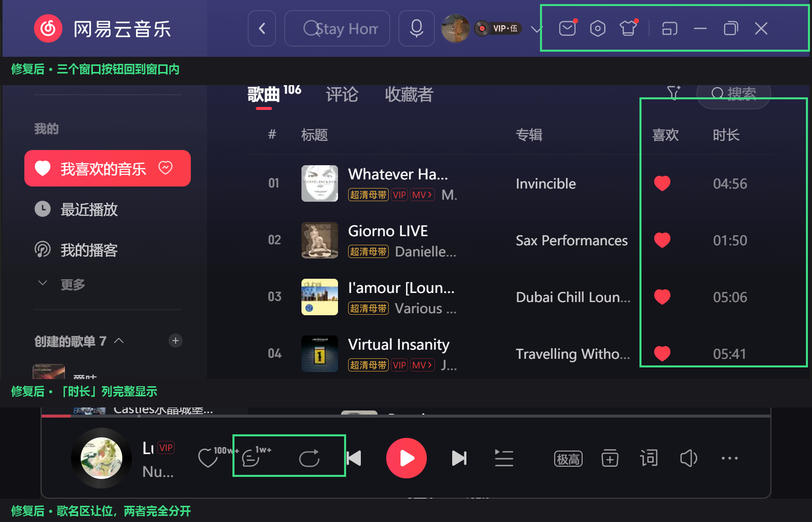

# CloudMusicLayoutFix

NetEase Cloud Music's PC client lays its UI out wrong on secondary monitors: everything past a fixed width is pushed outside the window and clipped, so the buttons you can see can't be clicked. The client hard-codes a 1056 px minimum width, and on a screen narrower than that (a 4K portrait screen at 200% scaling, a 1080p portrait screen at 125%, ...) the overflow simply gets cut off.

This tool doesn't patch the client. It starts the client with a local debugging port, attaches over the DevTools protocol and adds a stylesheet that removes those fixed widths. It runs for a split second at launch and exits - no resident process.



## When it happens

Any screen where `physical width / display scaling < 1056` triggers it: 1080×1920 @125% (864 CSS px) and 1600×2560 @200% (800 CSS px) both do. My two portrait screens reproduce it every time.

On the stock client, on a secondary monitor:

- the minimize / maximize / close buttons end up outside the window
- the "duration" column of a playlist falls off the screen, and the row buttons sit against the screen edge
- on the settings page the top section links run off-screen
- in the playback bar the like / comment buttons are pushed towards the playback controls, and on a narrower window they end up on top of them

On the primary monitor everything looks normal.

## Screenshots

Same screen, same window. Top: the stock client. Bottom: with the fix applied.





Each image shows the window title bar, a playlist and the playback bar. The playback row was shot with the window narrowed to 720 px (same screen) - that misalignment gets worse as the window gets narrower, and at 720 px the comment button sits on top of the play-order button.

## Usage

1. Download [CloudMusicLayoutFix.exe](https://github.com/AcmeLuo/CloudMusicLayoutFix/releases/latest) (35 KB, no installer, no Node.js)
2. Quit NetEase Cloud Music completely from the tray icon
3. Run it, answer Yes, allow Administrator rights

It installs itself over `cloudmusic.exe` in the client folder and keeps the official file as `cloudmusic.real.exe`. Every way of launching the client - Start Menu, taskbar, double-click - then applies the fix automatically. The program only lives for that split second at launch: no resident process, no tray icon.

Run `CloudMusicLayoutFix.exe --restore` to put the official client back.

| Mode | What it does |
| --- | --- |
| `--install` | install without the prompt |
| `--restore` | restore the official `cloudmusic.exe` |
| `--once` | inject once, change nothing |
| `--tray` | stay in the tray (re-injects on every client start and page reload) |

## How it works

The client's front end is packed in an encrypted container, so there is no source on disk to edit. But it's a CEF app and accepts `--remote-debugging-port`, so the tool launches it with that flag, attaches over the DevTools protocol and appends a stylesheet:

```css
[class*='RightContainer'] { flex: 1 1 0 !important; min-width: 0 !important; }  /* let the main pane shrink */
[class*='HeaderRow']      { display: flex !important; }                         /* title bar: grid -> flex */
[class*='IconBar']        { flex: 0 0 auto !important; }                        /* keep the window buttons */
```

Nothing but constraints is relaxed - no font sizes or control sizes change, so the UI keeps the size your display scaling asks for. On a wide enough screen (my primary) none of it applies and element positions are identical to stock.

The stylesheet lives in [css/layout-fix.css](css/layout-fix.css); the root cause, the per-screen audit and the build steps are in [docs/TECHNICAL.md](docs/TECHNICAL.md).

## Notes

**I searched for "NetEase Cloud Music secondary monitor clipped" / "close button missing" - is this it?**
Most likely. Quick check: drag the client to the secondary screen and the window buttons in the top right corner disappear, or a playlist column goes missing - and everything is fine again on the primary screen. That means the UI's minimum width is wider than the screen and the rest is being clipped.

**Nothing happened after installing - now what?**
Check `%LOCALAPPDATA%\CloudMusicLayoutFix\layout-injector.log`. You should see a line like `inject applied vw=… dpr=… closeVisible=true`. If it says `closeVisible=false`, the client renamed its UI classes (a major update) - open an issue with that log.

**Will a client update break it?**
Small ones won't: the styles match class name prefixes (`Content_`, `HeaderRow`, ...) rather than the per-build hash suffixes. If an update replaces `cloudmusic.exe`, run the tool once more.

**The client isn't in the default folder?**
It searches for it: `--app` → next to the tool → the running client process → registry uninstall entries → common paths → a shallow scan, and writes which one worked into the log. You can also pass `CloudMusicLayoutFix.exe --app "D:\your\path\cloudmusic.exe"`.

**Is it safe?**
It never touches audio and doesn't bypass any licence or paid feature. The only client file it touches is `cloudmusic.exe` itself (kept as `cloudmusic.real.exe`), and the debugging port only listens on 127.0.0.1.

**Does the UI get smaller?**
No. That's the difference from the `--force-device-scale-factor=1` workaround.

**Anything tighter on narrow screens?**
Two things: the search box, and the song title in the playback bar (ellipsised). That's the space that used to overflow.

**Antivirus flags it?**
Expected: a 35 KB exe with no code-signing certificate that asks for administrator rights looks suspicious to scanners. The full source is in the repo (`src/CloudMusicLayoutFix.cs`) - run `build-exe.cmd` to compile your own copy, or just allow it.

## License

MIT. Unofficial, not affiliated with NetEase.

Keywords: NetEase Cloud Music, cloudmusic, secondary monitor, portrait monitor, multi-monitor, high DPI, display scaling, 125% / 200% scaling, UI clipped, minimize/maximize/close buttons missing, duration column pushed off-screen, playback bar buttons overlapping, settings page off-screen, Windows 10, Windows 11.

中文说明见 [README.md](README.md).
